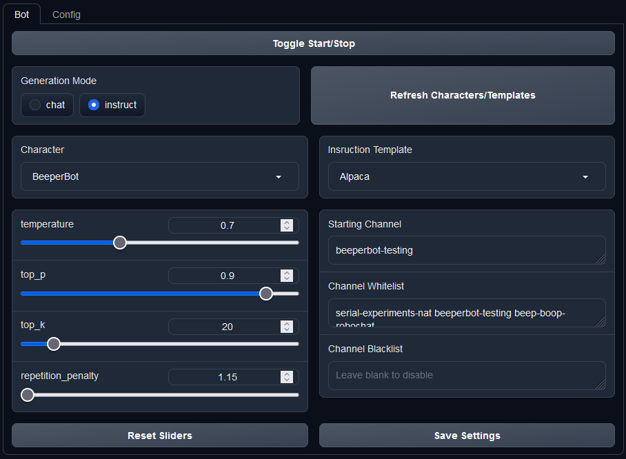

# BeeperBot - A text-generation-webui extension for creating AI Discord bots

## Setup

Put the URL of this repository into the "Install or update an extension" field in the "Session" tab and hit Enter. Enable the extension and restart text-generation-webui. If the extension fails to load, you may need to run `pip install -r requirements.txt` from within the extension's directory. Make sure you're in the correct env before you do this!

After a restart, navigate to the New "BeeperBot" tab and in the "Config" sub-tab, put the token of your Discord bot, then hit the "Save" button.

## Runtime configuration

In the "Bot" sub-tab next to "Config", you can control multiple fields such as:
- Character (See the [Character config](#character-config) section for more info)
    - The "Refresh Characters` button is there so if you create a character elsewhere and save it to disk, it gets updated in the dropdown
- Generation mode (See [Character config](#character-config))
- Several request parameter sliders
    - Note: Changes are applied instantly without the need to save each time. There's also a `Reset Sliders` button to reset them to default values (taken from the `simple-1` preset)
- Channel configs
    - "Starting Channel" is the channel where the bot will say a greeting automatically without any prompting
    - "Channel Whitelist"\* is a list of channels to use exclusively. Leave this blank to include all channels
    - "Channel Blacklist"\* is a list of channels to ignore

\* You may want to use only one of these at a time. I've not tested it with both

## Running

Once all the configuration is done, you can hit the "Toggle Start/Stop" button to toggle the bot on or off.

I suggest keeping the console window you're using for running text-generation-webui open as that's where a lot of debug info gets put. I plan to integrate a console into the UI later on.

## Character config

The list of characters are populated from different sources depending on the generation mode used:
- `chat` uses the built in `characters` folder to grab characters from and needs no additional configuration
- `instruct` also uses the same `characters` folder but requires you select an appropriate instruction template for your specified moder
